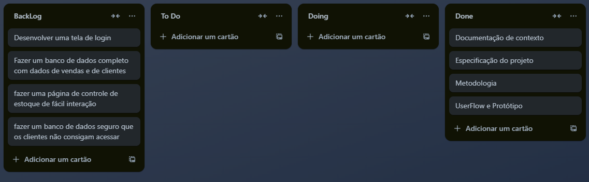

# Metodologia

Esta seção descreve a organização da equipe para a execução das tarefas do projeto e as ferramentas utilizadas para a manutenção dos códigos e demais artefatos.

## Gerenciamento de Projeto
A metodologia ágil escolhida para o desenvolvimento deste projeto foi o SCRUM, pois como citam Amaral, Fleury e Isoni (2019, p. 68), seus benefícios são a

“visão clara dos resultados a entregar; ritmo e disciplina necessários à execução; definição de papéis e responsabilidades dos integrantes do projeto (Scrum Owner, Scrum Master e Team); empoderamento dos membros da equipe de projetos para atingir o desafio; conhecimento distribuído e compartilhado de forma colaborativa; ambiência favorável para crítica às ideias e não às pessoas.”

### Divisão de Papéis

A equipe utiliza o Scrum como base para definição do processo de desenvolvimento.
A equipe está organizada desta forma:
- Scrum Master: Arthur Pereira.
- Product Owner: Guilherme Victor Moura Silva.
- Equipe de Desenvolvimento: Arthur Pereira, Guilherme Victor Moura, Graciele Santos, Matheus Zeíta.
- Equipe de Design: Arthur Pereira

> **Links Úteis**:
> - [11 Passos Essenciais para Implantar Scrum no seu 
> Projeto](https://mindmaster.com.br/scrum-11-passos/)
> - [Scrum em 9 minutos](https://www.youtube.com/watch?v=XfvQWnRgxG0)

### Processo

Decidimos utilizar o processo Scrum por ser o mais utilizado e mais fácil para o uso de projetos ágeis 
- Backlog: recebe as tarefas a serem trabalhadas e representa o Product Backlog. Todas as atividades identificadas no decorrer do projeto também devem ser incorporadas a esta lista. 
- To Do: Esta lista representa o Sprint Backlog. Este é o Sprint atual que estamos trabalhando. 
- Doing: Quando uma tarefa tiver sido iniciada, ela é movida para cá. 
- Done: nesta lista são colocadas as tarefas que passaram pelos testes e controle de qualidade e estão prontos para ser entregues ao usuário. Não há mais edições ou revisões necessárias, ele está agendado e pronto para a ação.

<figure> 
  Figura 2 - Quadro Kanban</figcaption>
</figure> 

> **Links Úteis**:
> - [Project management, made simple](https://github.com/features/project-management/)
> - [Sobre quadros de projeto](https://docs.github.com/pt/github/managing-your-work-on-github/about-project-boards)
> - [Como criar Backlogs no Github](https://www.youtube.com/watch?v=RXEy6CFu9Hk)
> - [Tutorial Slack](https://slack.com/intl/en-br/)

### Etiquetas

As tarefas são, ainda, etiquetadas em função da natureza da atividade e seguem o seguinte esquema de cores/categorias:

<ul>
  <li>Bug (Erro no código)</li>
  <li>Desenvolvimento (Development)</li>
  <li>Documentação (Documentation)</li>
  <li>Gerência de Projetos (Project Management)</li>
  <li>Infraestrutura (Infrastructure)</li>
  <li>Testes (Tests)</li>
</ul>

<figure> 
  Figura 3 - Tela do esquema de cores e categorias</figcaption>
</figure> 
  
### Ferramentas

Como ferramentas utilizamos o Visual Studio Code, pois já tem integração com o sistema de versionamento, utilizamos o Teams e o Whatsapp para comunicação do grupo, e por serem de facil utilização, utilizamos também o GitHub como repositório remoto, e o figma para fazer o protótipo e UserFlow e o trello para fazer o quadro kanban

Os artefatos do projeto são desenvolvidos a partir de diversas plataformas e a relação dos ambientes com seu respectivo propósito é apresentada na tabela que se segue.

| AMBIENTE                            | PLATAFORMA                         | LINK DE ACESSO                         |
|-------------------------------------|------------------------------------|----------------------------------------|
| Repositório de código fonte         | GitHub                             | http://....                            |
| Documentos do projeto               | GitHub                             | https://github.com/ICEI-PUC-Minas-PMV-ADS/pmv-ads-2024-1-e1-proj-web-t10-pmv-ads-2024-1-e1-proj-teleco/tree/main/documentos                            |
| Projeto de Interface                | Figma                              | https://www.figma.com/file/npy6heSZgCgWFO9ehUsW5p/Projeto?type=whiteboard&node-id=0-1&t=olcFtuMtVLLP1G6C-0                            |
| Gerenciamento do Projeto            | Trello                   | https://trello.com/invite/b/qocJrL3Z/ATTI227e5cc41ea27fcb7cdc70c211a30defEF3B7046/teleco                   |
| Hospedagem                          | GitHub Pages                       | http://....                            |

### Estratégia de Organização de Codificação 

Todos os artefatos relacionados a implementação e visualização dos conteúdos do projeto do site deverão ser inseridos na pasta [codigo-fonte](http://https://github.com/ICEI-PUC-Minas-PMV-ADS/WebApplicationProject-Template-v2/tree/main/codigo-fonte). Consulte também a nossa sugestão referente a estratégia de organização de codificação a ser adotada pela equipe de desenvolvimento do projeto.
