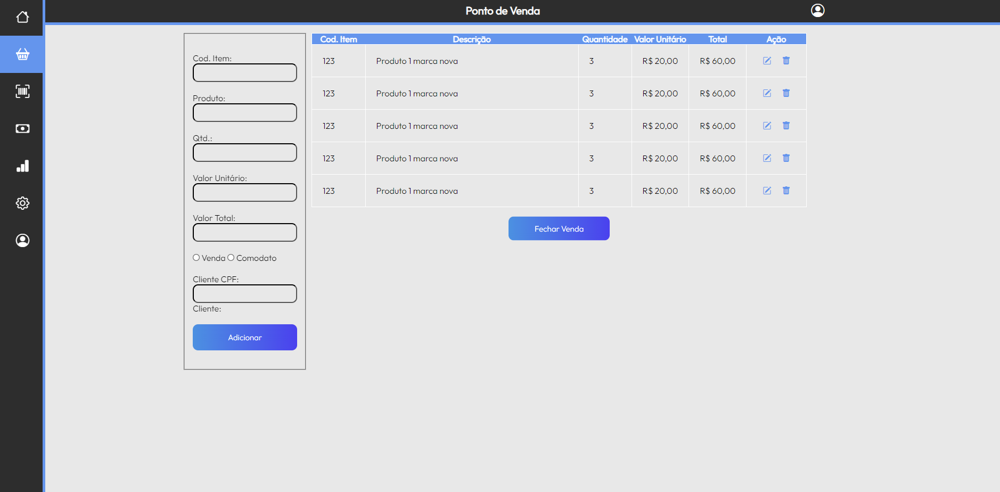

# Projeto de Interface

## User Flow

O fluxo de usuário permite os desenvolvedores terem um caminho a ser percorrido e coisas a fazerem para que o projeto desenvolva e evolua

<figure> 
  Figura 1 - Fluxo de Usuário</figcaption>
</figure> 

> **Links Úteis**:
> - [User Flow: O Quê É e Como Fazer?](https://medium.com/7bits/fluxo-de-usu%C3%A1rio-user-flow-o-que-%C3%A9-como-fazer-79d965872534)
> - [User Flow vs Site Maps](http://designr.com.br/sitemap-e-user-flow-quais-as-diferencas-e-quando-usar-cada-um/)
> - [Top 25 User Flow Tools & Templates for Smooth](https://www.mockplus.com/blog/post/user-flow-tools)

## Protótipo

Desenvolver um protótipo emerge como uma das maneiras mais ágeis e econômicas de validar uma ideia, conceito ou funcionalidade. Isso permite a interação, avaliação, modificação e aprovação das principais características de uma interface antes de entrar na fase de desenvolvimento. Leia o artigo [Protótipos: baixa, média ou alta fidelidade?](https://medium.com/ladies-that-ux-br/prot%C3%B3tipos-baixa-m%C3%A9dia-ou-alta-fidelidade-71d897559135).

### Protótipo de baixa fidelidade

Protótipos de baixa fidelidade apresentam de forma simplificada o design da interface e o relacionamento entre suas páginas, permitindo evolução da proposta da solução. Neste projeto, os utilizaremos para apoiar a validação dos requisitos e efetuar mudanças dos mesmos, caso seja necessário, para menor impacto na codificação da aplicação.

Aqui estão algumas das telas que vão fazer parte do sistema

<figure> 
  Figura 2 - Login</figcaption>
</figure> 

&nbsp;
<figure> 
  Figura 3 - Ponto de Venda</figcaption>
</figure> 

&nbsp;
<figure> 
  Figura 4 - Estoque</figcaption>
</figure> 

&nbsp;
<figure> 
  Figura 5 - Lançamento de caixa</figcaption>
</figure> 

&nbsp;
<figure> 
  Figura 6 - Fechamento de caixa</figcaption>
</figure> 

&nbsp;
<figure> 
  Figura 7 - Relatório Financeiro</figcaption>
</figure> 

&nbsp;
<figure> 
  Figura 8 - Relatório Comodato</figcaption>
</figure> 

&nbsp;
<figure> 
  Figura 9 - Configurações</figcaption>
</figure> 

&nbsp;
<figure> 
  Figura 10 - Gerenciar Usuários</figcaption>
</figure> 
 
&nbsp;
> **Links Úteis**:
> - [Protótipos vs Wireframes](https://www.nngroup.com/videos/prototypes-vs-wireframes-ux-projects/)
>- Ferramentas:
>> - [Pencil](https://pencil.evolus.vn/)
>> - [MarvelApp](https://marvelapp.com/)
>> - [Figma](https://www.figma.com/)

