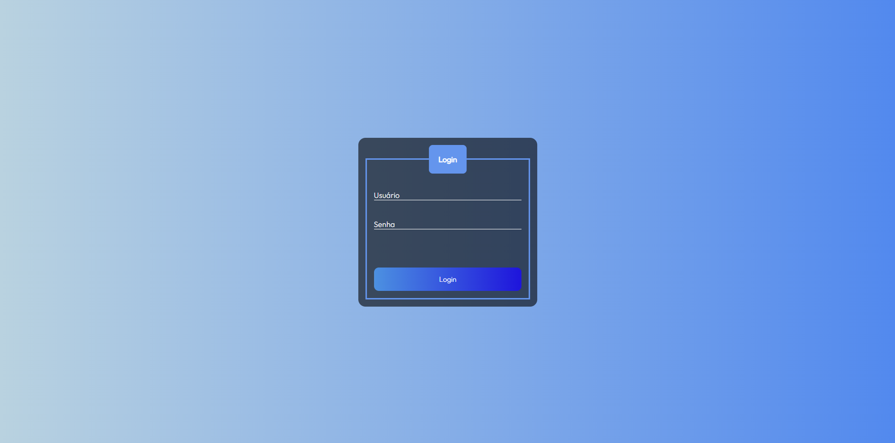

# Template padrão da Aplicação
O layout padrão do site foi construído com as linguagens de marcação HTML e CSS, e a linguagem de programação JavaScript foi utilizada para a construção do menu responsivo.

As páginas terão como elementos padrões o menu de navegação lateral, o header e o , além dos elementos de identidade visual citados abaixo:

* Cores: rgb(232, 232, 232), rgb(45, 45, 45), cornflowerblue, rgba(255,255,255 , 0.1), white, rgb(76, 145, 225), rgb(74, 65, 238);
* Font-family: Outfit, sans-serif;
* Font-size: 20px e 25px.

[Apresente a estrutura padrão da sua aplicação.]

# Tela de Login

&nbsp;

Solicita ao usuário seu login e senha para entrar no sistema.
<figure> 
  Figura 2 - Login</figcaption>
</figure> 

> **Links Úteis**:
>
> - [CSS Website Layout (W3Schools)](https://www.w3schools.com/css/css_website_layout.asp)
> - [Website Page Layouts](http://www.cellbiol.com/bioinformatics_web_development/chapter-3-your-first-web-page-learning-html-and-css/website-page-layouts/)
> - [Perfect Liquid Layout](https://matthewjamestaylor.com/perfect-liquid-layouts)
> - [How and Why Icons Improve Your Web Design](https://usabilla.com/blog/how-and-why-icons-improve-you-web-design/)
