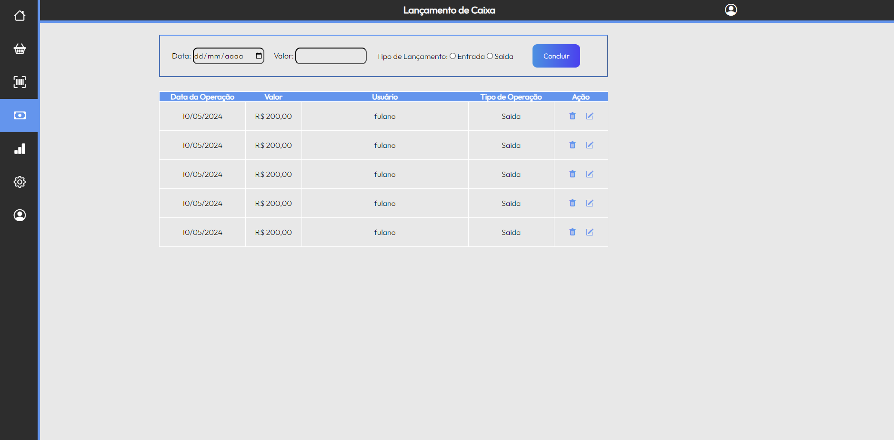

# Programação de Funcionalidades

Implementação da aplicação descritas por meio dos requisitos codificados. 

[Utilize a estrutura abaixo para cada funcionalidade entregue na etapa]

### Título da funcionalidade

[Adicione imagem da funcionalidade/tela]

#### Requisito atendido

[RF-X: adicione a descrição do requisito atendido]

#### Artefatos da funcionalidade

[Adicione os nomes dos arquivos relacionados ao desenvolvimento da funcionalidade]

#### Estrutura de Dados

[Caso exista estrutura de dados, adicione aqui]

#### Instruções de acesso

[Adicione as orientações de acesso à funcionalidade]

#### Responsável

[Adicione nome do responsável pelo desenvolvimento da funcionalidade]

### Tela de Login (RF-01)

Responsável: Guilherme

A aplicação deve permitir ao usuário fazer login no sistema, com um campo para preencher o nome de usuário e um para digitar a senha.
Protótipo da tela:

<figure> 
  Figura 1 - Tela de Login</figcaption>
</figure>

#### Requisito atendido

RF-01 A aplicação deve permitir ao usuário fazer login no sistema.

#### Artefatos da funcionalidade

index.html
https://cdn.jsdelivr.net/npm/bootstrap-icons@1.11.3/font/bootstrap-icons.min.css
style.css
index.css

#### Estrutura de Dados

[Caso exista estrutura de dados, adicione aqui]

#### Instruções de acesso

[Adicione as orientações de acesso à funcionalidade]

### Tela de Lançamento de Caixa (RF-02)

Responsável: Matheus

A aplicação deve relatar as operações financeiras ocorridas no sistema.

<figure> 
  Figura 2 - Lançamento de Caixa</figcaption>
</figure>

#### Requisito atendido

RF-02 

A aplicação deve relatar as operações financeiras ocorridas no sistema.

#### Artefatos da funcionalidade

caixa-lancamento.css
caixa-lancamento.html
https://cdn.jsdelivr.net/npm/bootstrap-icons@1.11.3/font/bootstrap-icons.min.css
style.css

#### Estrutura de Dados

[Caso exista estrutura de dados, adicione aqui]

#### Instruções de acesso

[Adicione as orientações de acesso à funcionalidade]

### Tela de Relatório Financeiro (RF-03)

Responsável: Matheus

A aplicação deve relatar as operações financeiras realizadas no estoque(abastecimento e retirada).

<figure> 
  Figura 3 - Relatório Financeiro</figcaption>
</figure>

#### Requisito atendido

RF-03

A aplicação deve relatar as operações financeiras realizadas no estoque(abastecimento e retirada).

#### Artefatos da funcionalidade

relatorio-financeiro.html
relatorio-financeiro.html
https://cdn.jsdelivr.net/npm/bootstrap-icons@1.11.3/font/bootstrap-icons.min.css
style.css

#### Estrutura de Dados

[Caso exista estrutura de dados, adicione aqui]

#### Instruções de acesso

[Adicione as orientações de acesso à funcionalidade]

> **Links Úteis**:
> - [Trabalhando com HTML5 Local Storage e JSON](https://www.devmedia.com.br/trabalhando-com-html5-local-storage-e-json/29045)
> - [JSON Tutorial](https://www.w3resource.com/JSON)
> - [JSON - Introduction (W3Schools)](https://www.w3schools.com/js/js_json_intro.asp)
> - [JSON Tutorial (TutorialsPoint)](https://www.tutorialspoint.com/json/index.htm)

