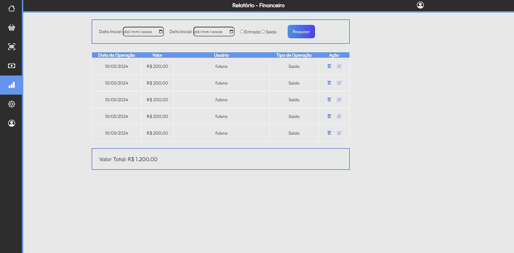
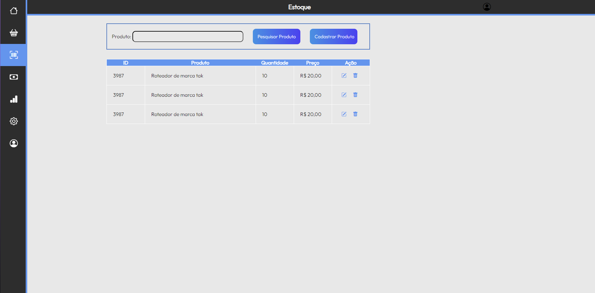

### Tela de Login (RF-01)

Responsável: Guilherme

A aplicação deve permitir ao usuário fazer login no sistema, com um campo para preencher o nome de usuário e um para digitar a senha.
Protótipo da tela:

<figure> 
  Figura 1 - Tela de Login</figcaption>
</figure>

#### Requisito atendido

RF-01 A aplicação deve permitir ao usuário fazer login no sistema.

#### Artefatos da funcionalidade

index.html
https://cdn.jsdelivr.net/npm/bootstrap-icons@1.11.3/font/bootstrap-icons.min.css
style.css
index.css

### Tela de Lançamento de Caixa (RF-02)

Responsável: Matheus

A aplicação deve relatar as operações financeiras ocorridas no sistema.

<figure> 
  Figura 2 - Lançamento de Caixa</figcaption>
</figure>

#### Requisito atendido

RF-02 A aplicação deve relatar as operações financeiras ocorridas no sistema.

#### Artefatos da funcionalidade

caixa-lancamento.css
caixa-lancamento.html
https://cdn.jsdelivr.net/npm/bootstrap-icons@1.11.3/font/bootstrap-icons.min.css
style.css

### Tela de Relatório Financeiro (RF-03)

Responsável: Matheus

A aplicação deve relatar as operações financeiras realizadas no estoque(abastecimento e retirada).

<figure> 
  Figura 3 - Relatório Financeiro</figcaption>
</figure>

#### Requisito atendido

RF-03 A aplicação deve relatar as operações financeiras realizadas no estoque(abastecimento e retirada).

#### Artefatos da funcionalidade

relatorio-financeiro.html
relatorio-financeiro.html
https://cdn.jsdelivr.net/npm/bootstrap-icons@1.11.3/font/bootstrap-icons.min.css
style.css

### Tela de Gerenciar Usuários (RF-04)

Responsável: Guilherme

A aplicação deve permitir ao usuário editar e alterar seus dados.

<figure> 
  Figura 4 - Gerenciar Usuários</figcaption>
</figure>

#### Requisito atendido

RF-04 A aplicação deve permitir ao usuário editar e alterar seus dados.

#### Artefatos da funcionalidade

usuariogerenciar.html
usuariogerenciar.html
https://cdn.jsdelivr.net/npm/bootstrap-icons@1.11.3/font/bootstrap-icons.min.css
style.css

### Tela de Ponto de Venda(PDV) (RF-05)

Responsável: Guilherme

A aplicação deve informar ao usuário quanto a compras, atendimentos e visitas a clientes feitas e programadas.

<figure> 
  Figura 5 - Ponto de Venda</figcaption>
</figure>

#### Requisito atendido

RF-05 A aplicação deve informar ao usuário quanto a compras, atendimentos e visitas a clientes feitas e programadas.

#### Artefatos da funcionalidade

pdv.html
pdv.html
https://cdn.jsdelivr.net/npm/bootstrap-icons@1.11.3/font/bootstrap-icons.min.css
style.css

### Tela de Lançamento de Caixa (RF-06)

Responsável: Matheus

A aplicação deve permitir ao usuário inserir, alterar e deletar informações quanto ao fluxo de caixa.

<figure> 
  Figura 6 - Lançamento de Caixa</figcaption>
</figure>

#### Requisito atendido

RF-06 A aplicação deve permitir ao usuário inserir, alterar e deletar informações quanto ao fluxo de caixa.

#### Artefatos da funcionalidade

caixa-lancamento.html
caixa-lancamento.html
https://cdn.jsdelivr.net/npm/bootstrap-icons@1.11.3/font/bootstrap-icons.min.css
style.css

### Tela de Estoque (RF-07)

Responsável: Arthur

A aplicação deve relatar o que há no estoque físico.

<figure> 
  Figura 7 - Lançamento de Caixa</figcaption>
</figure>

#### Requisito atendido

RF-07 A aplicação deve relatar o que há no estoque físico.

#### Artefatos da funcionalidade

estoque.html
estoque.html
https://cdn.jsdelivr.net/npm/bootstrap-icons@1.11.3/font/bootstrap-icons.min.css
style.css

