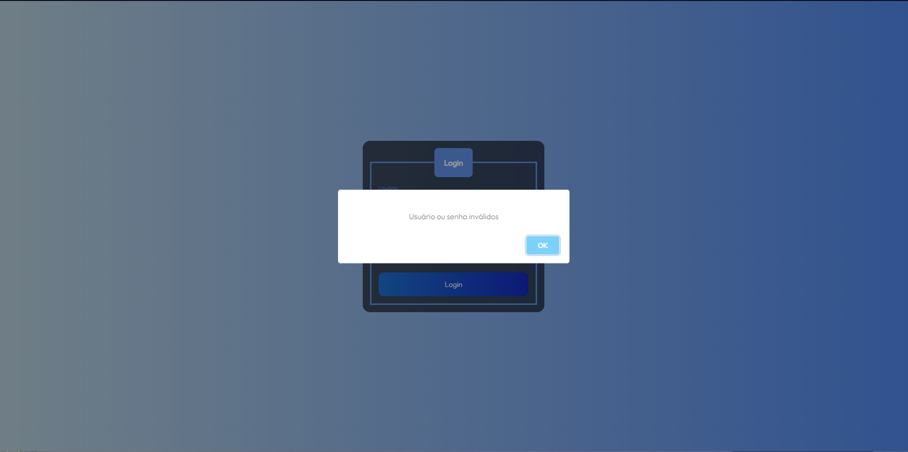
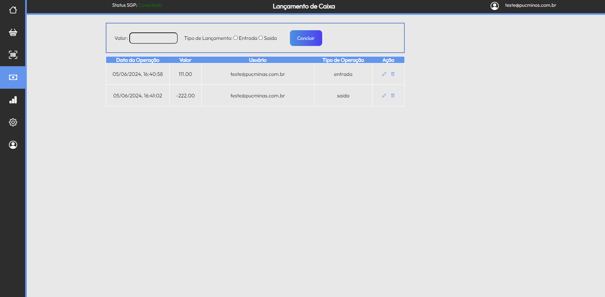
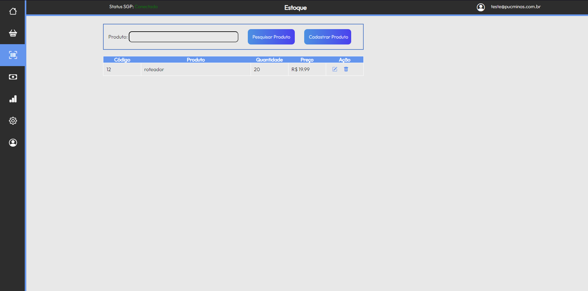
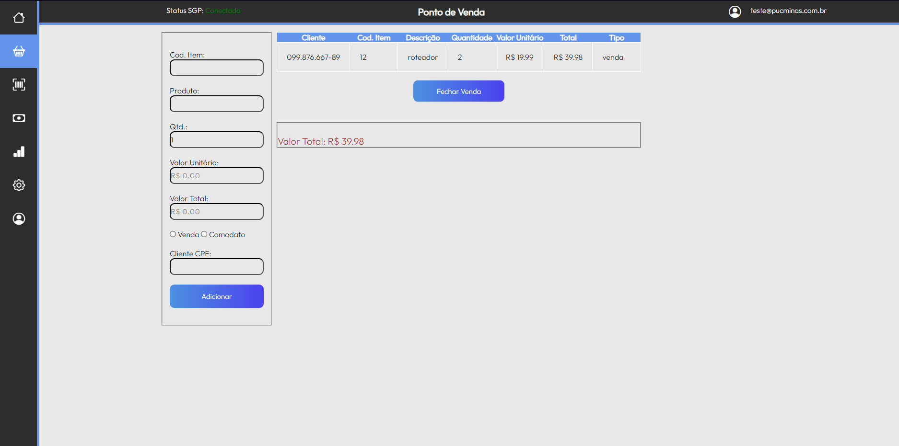
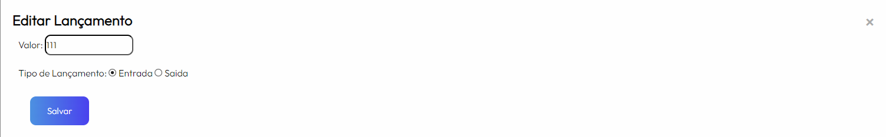

# Registro de Testes de Software

Relatório com as evidências dos testes de software realizados na aplicação pela equipe, baseado no plano de testes pré-definido.

|Caso de Teste    | CT-01 - Verificar se o site permite o usuário fazer login |
|:---|:---|
| Resultados obtidos | Ao digitar o usuário e senha corretos o usuário faz login no sistema  |
| Responsável pela execução do caso de Teste | Arthur |

| Resultados obtidos | Ao digitar o usuário e senha incorretos o usuário não faz login no sistema e aparece um erro avisando de usuario e senhas incorreto|
<figure> 
  Figura 1 - Erro de senha ou usuário</figcaption>
</figure>

| Responsável pela execução do caso de Teste | Arthur |

|Caso de Teste    | CT-02 - Verificar se a aplicação relata as operações financeiras ocorridas |
|:---|:---|
| Resultados obtidos | A aplicação relatou as operações financeiras corretamente  |
| Responsável pela execução do caso de Teste | Arthur | 
<figure>
  Figura 2 - Operações financeiras</figcaption>
</figure>

|Caso de Teste    | CT-03 - Verificar se a aplicação relata as operações financeiras ocorridas no estoque |
|:---|:---|
| Resultados obtidos | A aplicação relatou as operações financeiras ocorridas no estoque corretamente  |
| Responsável pela execução do caso de Teste | Arthur | 
<figure>
  Figura 3 - Operações financeiras do estoque</figcaption>
</figure>

|Caso de Teste    | CT-04 - Verificar se a aplicação informa ao usuário as compras feitas |
|:---|:---|
| Resultados obtidos | A aplicação relatou as compras feitas corretamente  |
| Responsável pela execução do caso de Teste | Arthur | 
<figure>
  Figura 4 - compras</figcaption>
</figure>

|Caso de Teste    | CT-05 - Verificar se a aplicação permite os usuários inserirem informações |
|:---|:---|
| Resultados obtidos | A aplicação permitiu o usuario alterar as informações  |
| Responsável pela execução do caso de Teste | Arthur | 
<figure>
  Figura 5 - Editar caixa</figcaption>
</figure>

|Caso de Teste    | CT-06 -  aplicação deve informar ao usuário o que há no estoque físico |
|:---|:---|
| Resultados obtidos | A aplicação informa o que há no estoque  |
| Responsável pela execução do caso de Teste | Arthur |
<figure> 
  Figura 6 - Estoque</figcaption>
</figure>

|Caso de Teste    | CT-07 - A aplicação deve alertar o usuário quanto a necessidade de reabastecer o estoque |
|:---|:---|
| Resultados obtidos | A aplicação alerta a necessidade de reabastecer  |
| Responsável pela execução do caso de Teste | Arthur |
<figure> 
  Figura 7 - Estoque Insuficiente</figcaption>
</figure>

